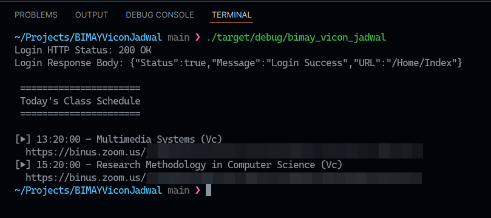

# BINUSMaya Schedules

> [!IMPORTANT]
> With the deprecation of [BINUSMaya Jadwal](https://bm5jadwal.azurewebsites.net) along with the introduction of [New BINUSMaya](https://newbinusmaya.binus.ac.id), this project is no longer maintained.

📅 | Shows BINUSMaya schedule on your terminal (and auto opens upcoming video conference class!)

---

[](https://asciinema.org/a/btBZxKnrRwZBNtbkqqVu2rpG1)



## Installation

Download the latest stable build using the side menu [(or by clicking here)](https://github.com/angeloanan/bimay_vicon_jadwal/releases).

If you live on the bleeding edge, you can also download the latest development build on [the actions tab](https://nightly.link/angeloanan/bimay_vicon_jadwal/workflows/dev-release/main).

## Building from scratch

You will need to have Rust installed. Run the following commands:

```sh
git clone https://github.com/angeloanan/bimay_vicon_jadwal.git
cd bimay_vicon_jadwal

cargo build --release
```

## Why? Motivation and stuff below

I found it hassling to basically get my schedule off of BINUS' myclass website. Simply getting the Video Conference meeting link everytime there is class is really painful.

The steps that I would take to get my schedule is:

1. Open browser
2. Type `bm5` and let Autocomplete completes to `https://bm5jadwal.azurewebsites.net/`
3. Type `CTRL + SHIFT + X` to unlock my password manager and type my password
4. Choose my credentials and click login
5. Wait for a bit and click link that is the highest entry on the table

Mind you, most of the time, I am half awake at this state. I would have typo'd my password alot and simply navigating to it is painful.

With this simple CLI app, I hope that I can incrementally "replace" the schedule website such that its much friendlier and easier to use (if not for ya'll, atleast for me). I will add more features that will make life easier.

### Implemented Features

-   Getting today's schedule, sorted by time and filtered by already happenning
-   Auto opening upcoming / current class video conference link

### Planned Features

-   Running app on the background to remind and auto join future conference
-   Advanced schedule class indicator (If ongoing, use `>` for status and show time until end, and leave status empty for upcoming stuff)
-   Synchronization to a Calendar (Google Calendar, Outlook Calendar, etc)
-   Fetching Forum link for GSLCs, including auto template reply
